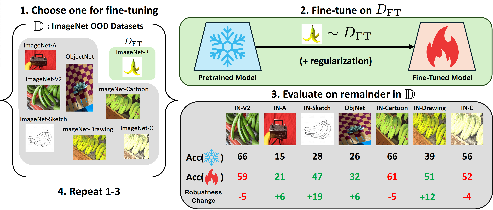
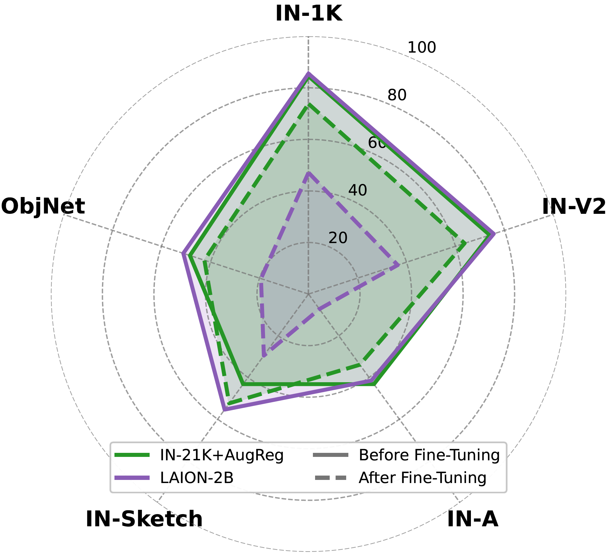
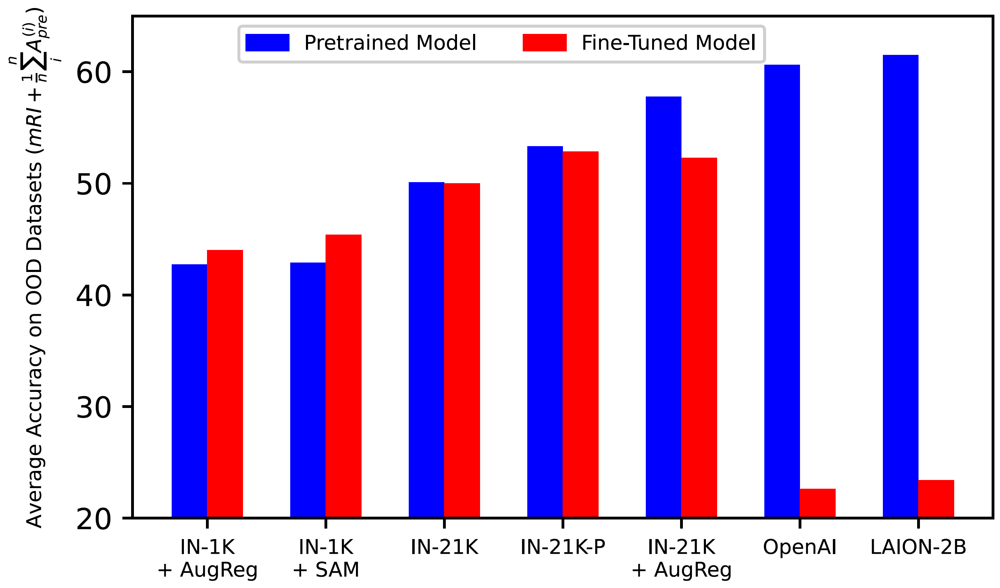

# ImageNet-RIB Benchmark: Large Pre-Training Datasets Don't Guarantee Robustness after Fine-Tuning

**TL;DR:** We demonstrate that models pretrained on larger datasets can exhibit poorer robustness after fine-tuning compared to models pretrained on smaller datasets when the fine-tuning dataset is small. We analyze this phenomenon using the proposed benchmark.


<p align="center">
  
</p>


## Download Dataset
Please refer to the instruction from the each dataset.
* [ImageNet-V2](https://imagenetv2.org/)
* [ImageNet-A](https://github.com/hendrycks/natural-adv-examples)
* [ImageNet-R](https://github.com/hendrycks/imagenet-r)
* [ImageNet-Sketch](https://github.com/HaohanWang/ImageNet-Sketch)
* [ObjectNet-1.0](https://objectnet.dev/download.html)
* [ImageNet-Cartoon & ImageNet-Drawing](https://tiagosalvador.github.io/projects/imagenet-shift/)
* [ImageNet-C](https://github.com/hendrycks/robustness)

## Running
```
python3 main.py  --root  datasets/ --batch_size 64 --epochs 10 \
  --arch $arch --patch_size $patch_size --d_pre $pretrained --model $model \
  --regularization $reg --dataset $dataset --no_split --use_wandb
```

## Results
<p align="center">
  
  <br>
  OOD accuracy (robustness) of a ViT-B/16 model pretrained on two different datasets (LAION-2B, IN-21K), before and after fine-tuning on ImageNet-R.
</p>

<p align="center">
  
<br>
Severe robustness loss from fine-tuning models pretrained on LAION-2B and OpenAI relative to fine-tuning models pretrained only on smaller datasets.  
</p>

## Acknowledgement
This repository is based on multiple repository including 
* https://github.com/hjbahng/visual_prompting
* https://github.com/huggingface/pytorch-image-models
* https://github.com/microsoft/otdd


## Citation
If you use this code for your research, please cite our paper.


```
@inproceedings{hwang2024imagenet,
      title={ImageNet-RIB Benchmark: Large Pre-Training Datasets Don't Guarantee Robustness after Fine-Tuning},
      author={Hwang, Jaedong and Cheung, Brian and Hong, Zhang-Wei and Boopathy, Akhilan and Agrawal, Pulkit and Fiete, Ila R},
      booktitle={NeurIPSW on Fine-Tuning in Modern Machine Learning: Principles and Scalability},
      year={2024}
    }
```
